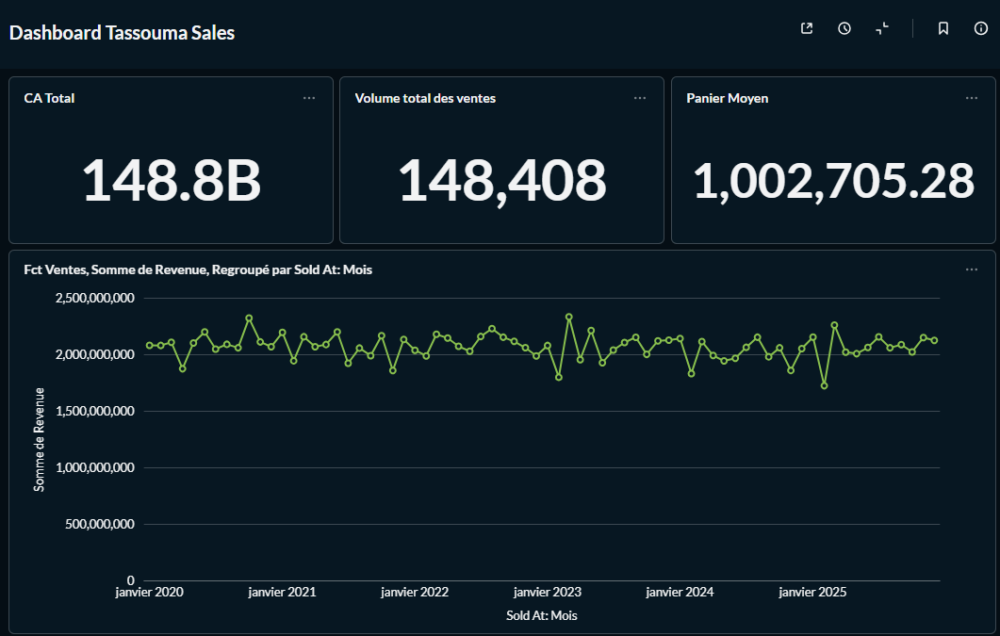
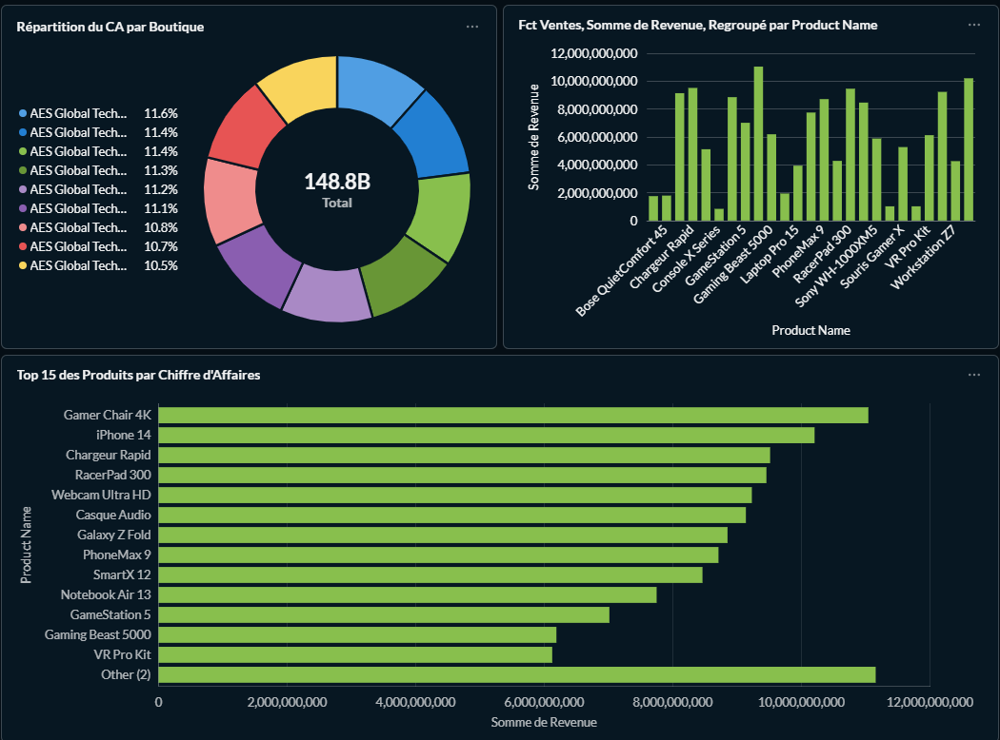

# Tassouma Sales Analytics | Modern Data Stack (ELT)

**Yacouba DIALLO — INGÉNIEUR BIG DATA**

Pipeline de données haute performance conçu pour centraliser et analyser les flux de ventes multi-boutiques (Région AES). Cette solution automatise l'ingestion, le stockage en Data Lake, la modélisation en Warehouse et la restitution BI, le tout orchestré dans un environnement conteneurisé.

---

## Architecture du Pipeline

L'infrastructure repose sur une architecture **cloud-native** entièrement conteneurisée, garantissant scalabilité et isolation des services.

```mermaid
graph LR
    subgraph "Sources (On-premise)"
        DB[(MySQL)]
    end

    subgraph "Orchestration"
        AF[Apache Airflow]
    end

    subgraph "Data Lake (S3)"
        MI[MinIO Storage]
    end

    subgraph "Data Warehouse"
        PG[(PostgreSQL)]
    end

    subgraph "Transformation & Viz"
        DBT[dbt Models]
        MB[Metabase Dashboards]
    end

    DB -->|Extraction| MI
    AF -.->|Orchestre| DB
    MI -->|Processing Spark| PG
    PG -->|Modélisation| DBT
    DBT --> PG
    PG --> MB
````

## Aperçu de la Solution

### Business Intelligence (Metabase)
Dashboards interactifs permettant le pilotage en temps réel des KPIs ventes, produits et performances par boutique.

| Vue d'ensemble (CA & Produits) | Analyse Détaillée |
| :--- | :--- |
|  |  |

---

## Stack Technique & Expertise

* **Ingestion & Infra** : Docker, Apache Airflow, MinIO (compatible S3 API).
* **Processing** : Python (Scripts ETL optimisés pour l'extraction et le chargement)
* **Data Modeling** : **dbt (data build tool)** — Utilisation de modèles incrémentaux et de tests de contraintes (*non-null*, *unique*) pour garantir l'intégrité du Warehouse (couches Bronze/Silver/Gold).
* **Storage** : PostgreSQL & MySQL.
* **BI & Dataviz** : Metabase (SQL interactif).

---

## Caractéristiques Avancées

* ** Scalabilité** : Architecture prête pour le traitement de volumes massifs via Spark.
* ** Qualité des Données** : Intégration de tests dbt pour assurer la fiabilité des KPIs.
* ** Isolation & Sécurité** : Utilisation de réseaux Docker dédiés pour la communication inter-services.

## Quick Start (Déploiement)

### 1. Prérequis
Assurez-vous d'avoir **Docker** et **Docker Compose** installés sur votre machine.

### 2. Installation

```bash
# Cloner le repository
git clone [https://github.com/yacoubadiallo/tassouma_bi.git](https://github.com/yacoubadiallo/tassouma_bi.git)
cd tassouma_bi

# Lancer l'ensemble de la stack
docker-compose up -d
````
### Endpoints & Monitoring

| Service | URL | Rôle |
| :--- | :--- | :--- |
| **Airflow** | `http://localhost:8080` | Orchestration & Logs des DAGs |
| **Metabase** | `http://localhost:3000` | Dashboards & Analyse BI |
| **MinIO** | `http://localhost:9001` | Interface de gestion du Data Lake |

---

### Structure du Projet

* **`/dags`** : Workflows automatisés (Scheduling & Ingestion).
* **`/tassouma_dbt`** : Logique de transformation business et modélisation SQL via dbt.
* **`/img`** : Ressources visuelles et captures d'écran du projet.
* **`ingestion_tassouma.py`** : Script d'extraction optimisé des sources vers le Lake.
* **`lake_to_warehouse.py`** : Script de chargement structuré vers PostgreSQL.

---

**Contact** : [Yacouba Diallo](https://github.com/yacoubadiallo) | **Ingénieur Big Data**
